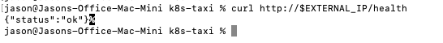
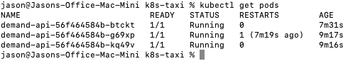
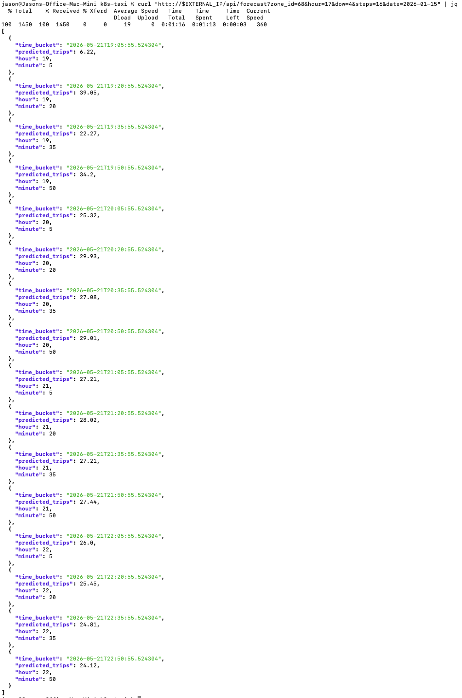

1. API health check: `curl http://$EXTERNAL_IP/health` returning {"status":"ok"}:

2. kubectl showing pods running and external IP assigned

3. At least one working API endpoint (/api/heatmap, /api/forecast, or /api/recommendations): 

GKE cluster deletion confirmation